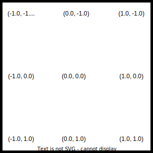

# ShadedPathV

## TODO
Course of action should be like this

- [x] \(done via themed timer) re-use old fps counter
- [x] Decouple Swap chain and backbuffer image rendering
- [x] backbuffer image saving
- [x] adapt backbuffer image size during rendering to window size
- [x] fix renderThreadContinue->wait() not waiting correctly (atomic_flag not suitable)
- [x] fix no shutdown for > 1 render threads
- [x] add *Release* version to the current *Debug* config in VS
- [x] TextureStore to read and organize KTX textures
- [x] Include *Dear ImGui* with standard Demo UI
- [ ] UI: FPS Counter
- [ ] finalize thread architecture
- [ ] image based tests
- [x] Thread pool for backbuffer rendering
- [ ] optimze thread performance
- [ ] vr view
- [ ] asset loading (library)
- [ ] Shaders
- [ ] vr controllers
- [ ] animation
- [ ] Demos
- [ ] Games

## Dependencies

copy to ../libraries:

* glf
* glm
* ktx
* vulkan

copy ktx.dll to executable path:
* vulkan\ShadedPathV\ShadedPathV\x64\Debug\ktx.dll

## Formats

To decide formats to use we can run the engine in presentation mode and get a list of all supported swap chain formats and presentation modes. On my Laptop and PC I get list below. We decided for the formats in **bold**

### Swap Chain Color Fomat and Space
| Format | VkFormat | Color Space | VkColorSpaceKHR |
| --- | --- | --- | --- |
| 44 | VK_FORMAT_B8G8R8A8_UNORM | 0 | VK_COLOR_SPACE_SRGB_NONLINEAR_KHR |
| **50** | **VK_FORMAT_B8G8R8A8_SRGB** | **0** | **VK_COLOR_SPACE_SRGB_NONLINEAR_KHR** |
| 64 | VK_FORMAT_A2B10G10R10_UNORM_PACK32 | 0 | VK_COLOR_SPACE_SRGB_NONLINEAR_KHR |

### Presentation mode

| Mode | VkPresentModeKHR |
| --- | --- | 
| 0 | VK_PRESENT_MODE_IMMEDIATE_KHR |
| **1** | **VK_PRESENT_MODE_MAILBOX_KHR** | 
| 2 | VK_PRESENT_MODE_FIFO_KHR | 
| 3 | VK_PRESENT_MODE_FIFO_RELAXED_KHR | 

### Thread Model

* renderThreadContinue: ThreadsafeWaitingQueue<> (host controlled)
* queue: FIFO queue (host controlled)
* presentFence: VkFence
* inFlightFence: VkFence

| Remarks                                         | Queue Submit Thread | Render Threads |
| -------------                                   | ------           | ------ |
| renderThreadContinue push()                     |                  | renderThreadContinue->pop() |
|                                                 |                  | drawFrame() |
|                                                 | queue.pop()      |             |
| presentFence was created in set mode            |                  | vkWaitForFences(presentFence) |
|                                                 |                  | vkReset |
|                                                 |                  | create graphics command buffers |
|                                                 |                  | queue.push() |
|                                                 |                  | renderThreadContinue->pop() |
|                                                 | vkQueueSubmit(inFlightFence) | |
|                                                 | vkWaitForFence(inFlightFence) |
|                                                 | vkReset |
|                                                 | vkAcquireNextImageKHR(swapChain) |
|                                                 | copy back buffer image to swapChain image |
|                                                 | vkQueueSubmit(presentFence) | |
|                                                 | vkQueuePresentKHR() |
|                                                 | renderThreadContinue push()
|                                                 |                  | vkWaitForFences(presentFence) |
|                                                 |                  | vkReset |
|                                                 |                  | drawFrame() |
|                                                 |                  | queue.push() |
|                                                 | queue.pop()      |             |
|                                                 |                  | renderThreadContinue->pop() |
|                                                 | vkQueueSubmit(inFlightFence) | |

## Coordinate Systems
### Vulcan Device Coordinates (X,Y)



### OpenXR

From the spec:
The OpenXR runtime must interpret the swapchain images in a clip space of positive Y pointing down, near Z plane at 0, and far Z plane at 1.

## Issues

* configure validation layers with Vulkan Configurator. Didn't succeed in configuring via app. Storing will enable debug config still active after configurator closes, but ALL Vulkan apps may be affected!
* Enable *Debug Output* option to see messages in debug console 

### Replay capture file

```C:\dev\vulkan>C:\dev\vulkan\libraries\vulkan\Bin\gfxrecon-replay.exe --paused gfxrecon_capture_frames_100_through_105_20211116T131643.gfxr```

### Integrate Renderdoc
* Download renderdoc
* Add this extension https://github.com/baldurk/renderdoc-contrib/tree/main/baldurk/whereismydraw
* See what it tells you

### Some arbitrary timings (we be moved elsewhere eventually)

All timings in [microseconds]
* [38000] Create/Copy small VertexBuffer (1 million times)
* [50] all w/o actual memcpy()

## Copyrights of used Components

* Dear ImGui: https://github.com/ocornut/imgui/blob/master/LICENSE.txt Copyright (c) 2014-2021 Omar Cornut
