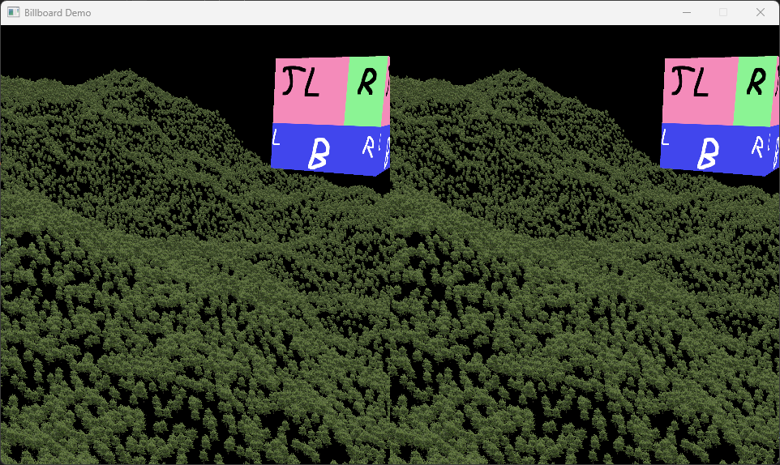

#  ShadedPathV 

Game Engine in Development!

ShadedPathV is a completely free C++ game engine built mainly on [Khronos standards](https://www.khronos.org/)

Some features:

- Rendering in multiple threads
- Each thread renders to its own backbuffer image, using its own set of thread local resources.
- Synchronization is done at presentation time, when the backbuffer image is copied to the app window
- Support VR games via OpenXR
- Sound support for ogg vorbis: Both background music and spatial sound attached to objects
- Upload of GPU resources in a background thread for stutter free rendering

**Table of content:**
- [Current State](#toc-state)
- [Blog](#toc-blog)
- [Setup](#toc-setup)
- [ToDo](#toc-todo)
- [Stereo Mode](#toc-stereo)
- [Formats](#toc-formats)
- [Thread Model](#toc-threads)
- [Coordinate System](#toc-coords)
- [Misc](#toc-misc)

<a id="toc-state"></a>

## Current State (Q3 / 2024)

## Using World Creator &copy; terrain

We now can directly import gltf exports from world creator (https://www.world-creator.com/). This is for base terrain glTF and heightmap.

There is also code to get terrain height directly from the terrain vertices in ultimate precision. (Meaning exact same precision as terrain itself.) It's a constant time algorithm based on finding the right terrain triangle for given x/z float value and interpolate to get the exact height within the triangle.


## Helper classes for app development

`` AppSupport `` class added which removes a lot of boilerplate code from applications. Mostly options and camera handling.

## OpenXR Enablement

All sample apps are now VR enabled through OpenXR.



## Q2 / 2024

## Screenshots

We always had the option to run the engine in screenshot mode, where every frame will be stored in the file system after rendering. This mode is mostly useful for automated tests. Now we added an option to store the next rendered single frame. The screenshot is taken from backbuffer, not from the output window, so it will be in the resolution of the backbuffer. See *LandacapeGenerator* app for details.

## Creating Heightmaps

Creating heightmaps requires 2 steps:

* Create a raw file with rectangular height data in world coordinates
* Convert the raw file to a ktx2 texture

You can use the LandscapeGenerator app to create heightmaps: just press **h** to store
a heightmap with the current pixel size. See the log to find the place where the file was written. Of course you can use any tool you like as long as you end up with a recangular raw file with 32-bit float values in world coordinates.

After that convert the raw file to ktx2 with a command like this:
```
ktx create --format R32_SFLOAT --raw --width 1025 --height 1025 ./heightmap.raw ./heightmap.ktx2
```

## Landscape generation with Diamond-square algorithm

We needed a way to generate landscapes and decided to implement the diamond-square algorithm. This is shown in the app *LandscapeGenerator*. It also utilizes the new background GPU uploading mechanism. Otherwise there would be stuttering because e.g. uploading 2 million lines to GPU memory takes longer than drawing a frame. Uploading is done in the background and only after it is finished the render threads switch to the new resource set.


## cmake build

Changed build from manual VS2022 project to cmake.

Currently this is Windows only. We also tried 
Mac build, but realized that their Vulkan support is lacking too much. Maybe we will pick up later if the situation changes. 

Linux build is tempting, but we haven't tried it yet.

We use **vcpkg** for dependency management. If some of the required libraries are missing the build will fail. If all dependencies are setup correctly on your local machine the build is initiated like this. Please adapt the toolchain file path to yours!

Clone the repo, then type commands in highest project folder:

Create the VS2022 project:
```
cmake -S . -B ./build -DCMAKE_TOOLCHAIN_FILE=c:\dev\vulkan\vcpkg\scripts\buildsystems\vcpkg.cmake
```

Now you can either open VS2022 from the ./build folder and build in the IDE, or run this command:
```
cmake --build ./build
```

If all goes well you will find the built app here: ``.build/src/app/Debug``

### Debugging

Make sure to copy https://github.com/icaven/glm/blob/master/util/glm.natvis to your local machine. This will enable you to see glm vectors in the debugger properly.
You can use this folder ``C:\Program Files (x86)\Microsoft Visual Studio\2022\Community\Common7\Packages\Debugger\Visualizers``. Adapt the path to your VS2022 installation.

<a id="toc-blog"></a>

## Q1 / 2023
## Using Objects from glTF files

Loading a glTF file is done like this. You just specify the file name and an id string that will be used to access meshes in this file. An id can only consist of letters and numbers and underscore.
```
engine.meshStore.loadMesh("grass.glb", "Grass");
```
Every object needs to be part of an object group (for some bulk operations).
If there is only one mesh in the file you can access it like so to position the object into the world:
```
engine.objectStore.createGroup("ground_group");
WorldObject *obj = engine.objectStore.addObject("ground_group", "Grass", vec3(0.0f, 0.0f, 0.0f));
```
If there are more meshes in the gltf file you add a number selector to it's id when adding it. To select the 7th mesh (counting starts at 0):
```
engine.objectStore.addObject("ground_group", "Grass.7", vec3(0.0f, 0.0f, 0.0f));
```
The first mesh is available both with ``Grass.0`` and ``Grass``.

## PAK Files

PAK file support for storing textures and glTF files in one big binary file. 

If ``data.pak`` is found in asset folder it is auto opened and parsed. All asset files found inside will be used instead of single files. Only files not found in the pak file will be tried in the other asset folders ``texture`` and ``mesh``.

PAK file creation is done with a simple Java class [Pak.java](./tools/texture/src/de/fehrprice/texture/Pak.java). Currently, the list of files to add is hard-coded in the Java class.

Rationale behind our pak file support is as follows:
* We need a way to protect the IP of assets. If we would simply ship assets in their original form anyone could just copy them into their own projects without any effort. The binary format is *very* simple, but still there is some protection. We will add a disclaimer to binary releases that reverse engineering of pak files is forbidden.
* There will be no pak file extractor tool. It is a one-way ticket - pak files should only be read by a running engine.
* Maybe we will need some more protection later (like encrypting assets in pak files), but for now this will do.

## Billboards


Performance is ok on my GTX 2080ti with displaying 50 million billboards in 30 to 120 FPS. (4K backbuffer rendering and 1440 Display Window)

50 Million Trees far away @120Hz              | 50 Million Trees closer @30Hz
:-------------------------:|:-------------------------:
  |  

## Mesh Shader

Started implementing a mesh shader for Billboard rendering, but realized that it is only supported with newer NVIDIA cards - not even my dev laptop does have this feature. So stopped for now.
There is a user API to enable the feature for vulkan device creation. Probably not worth to invest more time now and try to implement a mesh shader. Maybe if support is extendend it makes sense some day.

## Cube Maps

To be able to continue with PBR implementation we first need cube maps for a skybox.
The maps need to be prepared offline like so:
1. https://jaxry.github.io/panorama-to-cubemap/ Change rotation to 0. Load single file with distorted projection (and pixel width == 2* pixel height) into this url. Then click each tile to download all 6 .png files
1. ```toktx --genmipmap --uastc 3 --zcmp 18 --verbose --t2 --cubemap cube.ktx2 px.png nx.png py.png ny.png pz.png nz.png```

High res cube map in action:


## State Q2 / 2022

### Texture preparation

Textures not embedded in glTF have to be prepared for engine use. See batch file for details: [create_textures.sh](create_textures.sh).
Command line is ```../libraries/ktx/bin/toktx --genmipmap --uastc 3 --zcmp 18 --verbose --t2 ../data/texture/eucalyptus.ktx2 ../datainput/texture/eucalyptus.png```
PNG file must be properly exported: Remove ICC profile chunk during gimp export

### PBR Shader

As a first step we can now parse glTF files and render objects with just the base texture. No Lighting.


### Texture Loading from glTF Files

gltf-transform needs this to run natively on Windows powershell:
```
* KTX-Software has to be in path
* https://github.com/coreybutler/nvm-windows
* nvm install latest
* npm install --global --save @gltf-transform/core @gltf-transform/extensions @gltf-transform/functions
* npm install --global @gltf-transform/cli
* Test install via: gltf-transform uastc WaterBottle.glb bottle3.glb
```


Implemented texture workflow for reading glTF files:
1. Downloaded texture in glTF format (e.g. from Sketchfab) usually have simple .pga or .jpg textures with no mipmaps.
1. We decided to go for KTX 2 texture containers with supercompressed format VK_FORMAT_BC7_SRGB_BLOCK. It seems to be the only texture compression format that has wide adoption.
1. This solves two issues: texture size on GPU is greatly reduced and we can include mipmaps offline when preparing the glTF files.
1. We use gltf-transform like this to prepare glTF files for engine use:

   Examples:
   ```gltf-transform uastc WaterBottle.glb bottle2.glb --level 4 --zstd 18 --verbose```
   ```
   gltf-transform metalrough .\simple_grass_chunks.glb grass_pbr.glb
   gltf-transform uastc .\grass_pbr.glb grass.glb --level 2 --zstd 1 --verbose
   ```

   * KTX + Basis UASTC texture compression
   * level 4 is highest quality  - maybe use lower for development
   * zstd 18 is default level for Zstandard supercompression
   * gltf-transform creates mipmaps by default. use --filter to change default filter **lanczos4**

1. Decoding details are in **texture.cpp**. Workflow is like this (all methods from KTX library):

   >**Warning**
   >Do not forget to copy ktx.dll from ktx/bin to executable path. Especially after installing new ktx version!

   * the engine checks format support at startup like this: ```vkGetPhysicalDeviceFormatProperties(engine->global.physicalDevice, VK_FORMAT_BC7_SRGB_BLOCK, &fp);```
   * after loading binary texture data into CPU memory: **ktxTexture_CreateFromMemory()**
   * check that we have the right texture type: ```kTexture->classId == class_id::ktxTexture2_c``` If this fails we have read a KTX 1 type texture which we cannot handle.
   * check supercompression with ```ktxTexture2_NeedsTranscoding();```
   * inflate UASTC and transcode to GPU block-compressed format: ```ktxTexture2_TranscodeBasis(texture, KTX_TTF_BC7_RGBA, 0);```
   * last step is to upload to GPU: ```ktxTexture2_VkUploadEx()```

## Q1 / 2022

I am somewhat ok with thread model for now. Seems stable and flexible: Application can switch between non-threaded rendering and aribtrary number of rendering threads. But real test will be when more complex rendering code is available with objects and animation.

Still experimenting a lot with managing vulkan code in meaningful C++ classes. Especially for organizing shaders in an easy-to-use fashion and clear architecture.

Simple app with lines and debug texture: 

Red lines show the world size of 2 square km. Lines are drawn every 1m. White cross marks center. The texture is a debug texture that uses a different color on each mip level. Only mip level 0 is a real image with letters to identify if texture orientation is ok. (TL means top left...) Same texture was used for both squares, but the one in background is displayed with a higher mip level. While the camera moves further back you can check the transition between all the mip levels. On upper right you see simple FPS counter rendered with Dear ImGui.


Same scene with camera moved back. You see lines resembling floor level and ceiling (380 m apart). The textures are so small that they should use highest or 2nd highest mip level with 1x1 or 2x2 image size.

<a id="toc-setup"></a>

## Dev Setup and Library usage
Prerequisites that need to installed before dev setup:
* C++ 20 supported by CMake (VisualStudio 2022, gcc, clang,...)
* Vulkan SDK https://vulkan.lunarg.com/
* git
* cmake

Install ShadedPathV to empty folder ```sp```:
```
cd sp
git clone https://github.com/ClemensX/ShadedPathV.git
```

install vcpkg (for more details see https://learn.microsoft.com/en-us/vcpkg/get_started/get-started):
```
git clone https://github.com/microsoft/vcpkg.git
cd vcpkg
./bootstrap-vcpkg.sh or bootstrap-vcpkg.bat
```
Add vcpkg env var and add to path (e.g. in ``~/.bashrc`` or ``~/.zshrc``)
Linux/macos:
```
export VCPKG_ROOT=/path/to/vcpkg
export PATH=$VCPKG_ROOT:$PATH
```

The remaining dependencies should be auto-installed during the first build step. To build from within ShadedPathV folder: (TODO add openxr to dependencies)
```
cmake -S . -B ./build -DCMAKE_TOOLCHAIN_FILE=C:\tools\vcpkg\scripts\buildsystems\vcpkg.cmake
cmake --build ./build
```

Now you also can just open VS2022. The solution file is in the ``build`` folder

You may want to add GLSL support to Visual Studio 2022. E.g. this:
* Daniel Scherzers GLSL Visual Studio integration: https://marketplace.visualstudio.com/items?itemName=DanielScherzer.GLSL2022.
* Set path  to glslangValidator in VS Tools -> Options -> GLSL language integration -> External compiler. e.g. ``C:\dev\vulkan\libraries\vulkan\Bin\glslangValidator.exe``. Also, set -V as Arguments to enable Vulkan mode.

* **OpenXR**: install NuGet package OpenXR.Loader for all three projects in solution. If not found during compile or not displayed correctly: uninstall via NuGet Package Manager, then re-install


Use Khronos OpenXR sdk directly for VS 2022:
 * clone in parent of ShadedPathV folder, so that you have this folder structure:
 ```
 parent/
├── ShadedPathV/
└── OpenXR-SDK/
 ```
 * git clone https://github.com/KhronosGroup/OpenXR-SDK.git
 * in cmd: 
 ```
 mkdir build\win64
 cd build\win64
 cmake -G "Visual Studio 17" ..\..
 ```
 * open solution in VS 2022 at OpenXR-SDK\build\win64\OPENXR.sln and build
 * loader lib and pdb file will be here: \OpenXR-SDK\build\win64\src\loader\Debug
 * include folder here: \OpenXR-SDK\include\openxr
 * both include files and lib should be found by the cmake build, if not take a look at ``dependencies.cmake``
 
<a id="toc-todo"></a>

## TODO
Things finished and things to do. Both very small and very large things, just as they come to my mind. 

- [ ] Rework engine to allow multiple instances (remove static fields, apply manager pattern)
- [ ] rework FP object placement relative to cam (gun stuttering in *incoming* demo)
- [ ] Rest of PBR stages
- [ ] Environment maps
- [ ] BRDFLUT_TEXTURE cannot be used as cube map (all black). probably needs format conversion
- [ ] image based tests
- [ ] fix line shader backbuffer2 image wrong format in stereo mode if no dynamic add lines
- [x] add *Release* version to the current *Debug* config in cmake
- [x] Cube maps (needed for PBR environment maps)
- [x] Bug: billboard and possibly line shader cannot be last shader in app added (Validation Warning)
- [x] Bug: LineApp not running (problem with wireframe loading)
- [x] PBR Shader (simple: only base texture display, no lighting)
- [x] PBR object loading from glTF files (vertices with pos and text coord, textures)
- [x] Include KTX texture loading in PBR shader
- [x] \(done via themed timer) re-use old fps counter (still needs fixing - values too high?)
- [x] Decouple Swap chain and backbuffer image rendering
- [x] backbuffer image saving
- [x] adapt backbuffer image size during rendering to window size
- [x] fix renderThreadContinue->wait() not waiting correctly (atomic_flag not suitable)
- [x] fix no shutdown for > 1 render threads
- [x] TextureStore to read and organize KTX textures
- [x] Include *Dear ImGui* with standard Demo UI
- [x] UI: FPS Counter
- [x] Find assets by looking for 'data' folder up the whole path, starting at .exe location
- [x] Thread pool for backbuffer rendering
- [x] dynamic lines for LineShader (added lines live only for one frame) in V 1.2 API
- [x] check for vulkan profile support: VP_KHR_roadmap_2022 level 1 (requires Feb 2022 drivers, only checked for nvdia)
- [ ] Switch to V 1.3 API and get rid of framebuffer and renderpasses
- [ ] LineText Shader with coordinate system display and dynamic text
- [x] finalize thread architecture
- [ ] optimze thread performance
- [x] vr view
- [x] asset loading (library)
- [ ] Shaders
- [ ] vr controllers
- [ ] animation
- [ ] Demos
- [ ] Games

<a id="toc-stereo"></a>

## Stereo Mode

Activate stereo mode from client with one of these:
* engine.enableVR()
* engine.enableStereo()

Stereo mode will enable all shaders to draw twice, for left and right eye. All internale instances are named without qualifier for single view mode / left eye. And with **2** added to the name for right eye. E.g. for line shader framebuffer:

* VkFramebuffer ThreadResources.framebufferLine (for left eye or single view)
* VkFramebuffer ThreadResources.framebufferLine2 (for right eye)

Only left eye will be shown in presentation window unless double view is activated with **engine.enableStereoPresentation()**

<a id="toc-formats"></a>

## Formats

To decide formats to use we can run the engine in presentation mode and get a list of all supported swap chain formats and presentation modes. On my Laptop and PC I get list below. We decided for the formats in **bold**

### Swap Chain Color Fomat and Space
| Format | VkFormat | Color Space | VkColorSpaceKHR |
| --- | --- | --- | --- |
| 44 | VK_FORMAT_B8G8R8A8_UNORM | 0 | VK_COLOR_SPACE_SRGB_NONLINEAR_KHR |
| **50** | **VK_FORMAT_B8G8R8A8_SRGB** | **0** | **VK_COLOR_SPACE_SRGB_NONLINEAR_KHR** |
| 64 | VK_FORMAT_A2B10G10R10_UNORM_PACK32 | 0 | VK_COLOR_SPACE_SRGB_NONLINEAR_KHR |

### Presentation mode

| Mode | VkPresentModeKHR |
| --- | --- | 
| 0 | VK_PRESENT_MODE_IMMEDIATE_KHR |
| **1** | **VK_PRESENT_MODE_MAILBOX_KHR** | 
| 2 | VK_PRESENT_MODE_FIFO_KHR | 
| 3 | VK_PRESENT_MODE_FIFO_RELAXED_KHR | 

<a id="toc-threads"></a>

### Thread Model

* renderThreadContinue: ThreadsafeWaitingQueue<> (host controlled)
* queue: FIFO queue (host controlled)
* presentFence: VkFence
* inFlightFence: VkFence

| Remarks                                         | Queue Submit Thread | Render Threads |
| -------------                                   | ------           | ------ |
| renderThreadContinue push()                     |                  | renderThreadContinue->pop() |
|                                                 |                  | drawFrame() |
|                                                 | queue.pop()      |             |
| presentFence was created in set mode            |                  | vkWaitForFences(presentFence) |
|                                                 |                  | vkReset |
|                                                 |                  | create graphics command buffers |
|                                                 |                  | queue.push() |
|                                                 |                  | renderThreadContinue->pop() |
|                                                 | vkQueueSubmit(inFlightFence) | |
|                                                 | vkWaitForFence(inFlightFence) |
|                                                 | vkReset |
|                                                 | vkAcquireNextImageKHR(swapChain) |
|                                                 | copy back buffer image to swapChain image |
|                                                 | vkQueueSubmit(presentFence) | |
|                                                 | vkQueuePresentKHR() |
|                                                 | renderThreadContinue push()
|                                                 |                  | vkWaitForFences(presentFence) |
|                                                 |                  | vkReset |
|                                                 |                  | drawFrame() |
|                                                 |                  | queue.push() |
|                                                 | queue.pop()      |             |
|                                                 |                  | renderThreadContinue->pop() |
|                                                 | vkQueueSubmit(inFlightFence) | |

<a id="toc-coords"></a>

## Coordinate Systems
### Right Handed Coordinate System


Right-handed coordinate system (positive z towards camera) used for **ShadedPath Engine, OpenXR,** and **glTF**. (picture taken from [here](https://www.khronos.org/assets/uploads/developers/library/2018-siggraph/04-OpenXR-SIGGRAPH_Aug2018.pdf))

### OpenXR

From the spec (Chapter 2.16):
The OpenXR runtime must interpret the swapchain images in a clip space of positive Y pointing down, near Z plane at 0, and far Z plane at 1.

### Vulcan Device Coordinates (X,Y)


This means right handed with x (-1 to 1) to the right, y (-1 to 1) top to bottom and z (0 to 1) into the screen. See app **DeviceCoordApp** for details.

<a id="toc-misc"></a>

## Issues

* configure validation layers with Vulkan Configurator. Didn't succeed in configuring via app. Storing will enable debug config still active after configurator closes, but ALL Vulkan apps may be affected!
* Enable *Debug Output* option to see messages in debug console 

### Replay capture file

```C:\dev\vulkan>C:\dev\vulkan\libraries\vulkan\Bin\gfxrecon-replay.exe --paused gfxrecon_capture_frames_100_through_105_20211116T131643.gfxr```

### Integrate RenderDoc
* Download/install renderdoc
* Optionally add this extension https://github.com/baldurk/renderdoc-contrib/tree/main/baldurk/whereismydraw
* Use ``engine.setFixedPhysicalDeviceIndex(0)`` in app. Needed because RenderDoc and Vulkan Profiles (vpGetPhysicalDeviceProfileSupport()) do not work together. Reasons unknown. Using this setting disables the physical device capabilities checks.

### glTF Model Handling

Online Model Viewer (drag-and-drop):

```https://gltf-viewer.donmccurdy.com/```


Enable compression and create mipmaps:

```gltf-transform uastc WaterBottle.glb bottle2.glb --level 4 --zstd 18 --verbose```

## Internal

Stuff probably only intersting for internal development: [planning.md](./planning.md)

## Copyrights of used Components

* Dear ImGui: https://github.com/ocornut/imgui/blob/master/LICENSE.txt Copyright (c) 2014-2021 Omar Cornut
* Coordinate system image: By Watchduck - Own work, CC BY-SA 4.0, https://commons.wikimedia.org/w/index.php?curid=58162563
* Coordinate system image: https://www.khronos.org/assets/uploads/developers/library/2018-siggraph/04-OpenXR-SIGGRAPH_Aug2018.pdf
* tinygltf
  * json.hpp : Licensed under the MIT License http://opensource.org/licenses/MIT. Copyright (c) 2013-2017 Niels Lohmann http://nlohmann.me.
  * stb_image : Public domain.
  * catch : Copyright (c) 2012 Two Blue Cubes Ltd. All rights reserved. Distributed under the Boost Software License, Version 1.0.
  * RapidJSON : Copyright (C) 2015 THL A29 Limited, a Tencent company, and Milo Yip. All rights reserved. http://rapidjson.org/
  * dlib(uridecode, uriencode) : Copyright (C) 2003 Davis E. King Boost Software License 1.0. http://dlib.net/dlib/server/server_http.cpp.html

## Asset Licenses
[licenses.txt](./licenses.txt)