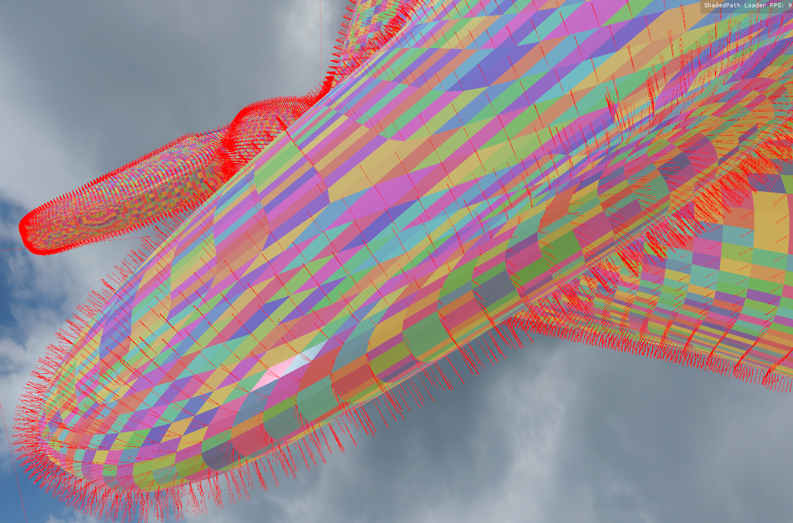
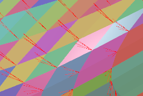
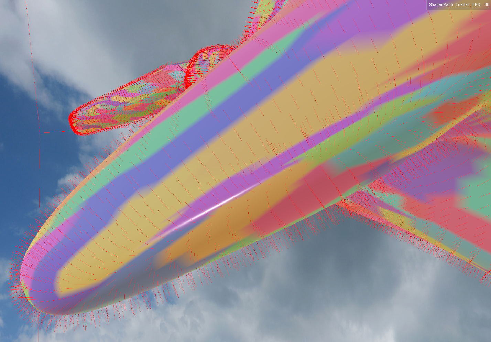

# Meshlets

It is important to use a properly defined base mesh for use with meshlets. Often, vertices are duplicated and differ only in normal values. To help checking that you can enable debug graphics on any object. Here is an example of a base mesh with many vertices duplicated:

 

Detail view: 

The same model, but all vertices at the same position merged into one:
 

In Blender, this can be achieved by going into edit mode, selecting all vertices, then open the *Normal Menu* (Alt-N) and select **Merge**.

Be aware, that if you want to merge meshlets to reduce complexity or not is entirely up to you. Some models may benefit, some may be rendered incorrectly. For example if you have normal values in a texture (as you should if using PBR rendering) reducing the vertex normals may be a good idea. But reducing number of vertex normals may reduce smoothenes of your model.
